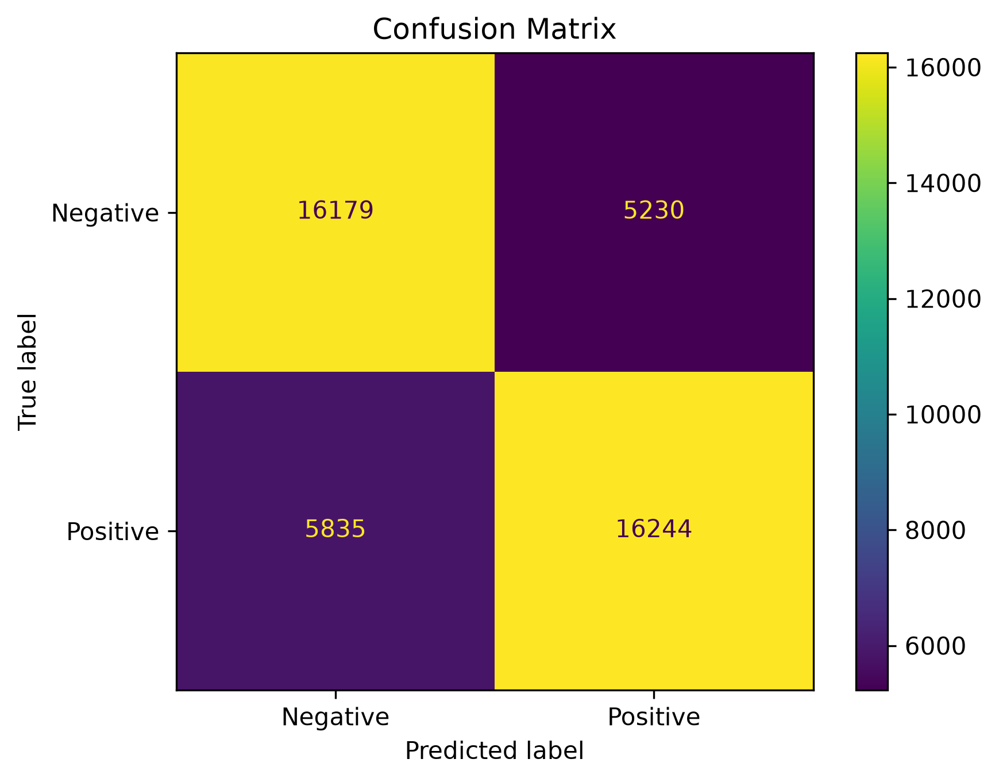

False Positive: 5230
False Negative: 5835
True Positive: 16244
True Negative: 16179

модель немного уходит в false negative. То есть модель немного чаще ошибочно принимает позитивные тексты за негативные, чем негативные за позитивные. при этом разница не велика

анализ своих выражений
Text: Сегодня прекрасный день, я очень счастлив
Prediction: Positive
Negative: 0.1566, Positive: 0.8434

Text: Спасибо, мне всё очень понравилось
Prediction: Positive
Negative: 0.1177, Positive: 0.8823

Text: Я ненавижу этот ужасный день
Prediction: Negative
Negative: 0.9884, Positive: 0.0116

Text: Мне очень грустно и плохо
Prediction: Negative
Negative: 0.9963, Positive: 0.0037

Text: Этот фильм совсем не плохой
Prediction: Negative
Negative: 0.6252, Positive: 0.3748

Text: Как же здорово снова заболеть
Prediction: Negative
Negative: 0.8413, Positive: 0.1587

Text: Прекрасно, автобус опять опоздал на час
Prediction: Negative
Negative: 0.7833, Positive: 0.2167

Text: ЕДиная россия - делает вбросы на выборах
Prediction: Positive
Negative: 0.4865, Positive: 0.5135

Text: Ерундистика какая-то, но мне понравилось
Prediction: Positive
Negative: 0.4486, Positive: 0.5514

Text: Я не могу поверить, что это произошло, это не приколько
Prediction: Negative
Negative: 0.8355, Positive: 0.1645

модель хорошо классифицирует явные утверждения, где есть яркие эмоциональные маркеры
с отрицанияем модель не всегда справляется адекватно, видно в одном месте она проигнорировала его хотя у нас и стоит ngram_range=(1, 2)
сарказмы модель не может адекватно понять, как я понял она просто смотрит на слова маркеры, не понимая сути выражения
и если есть противоречивые выражения она не может нормально определиться с оттенком фразы